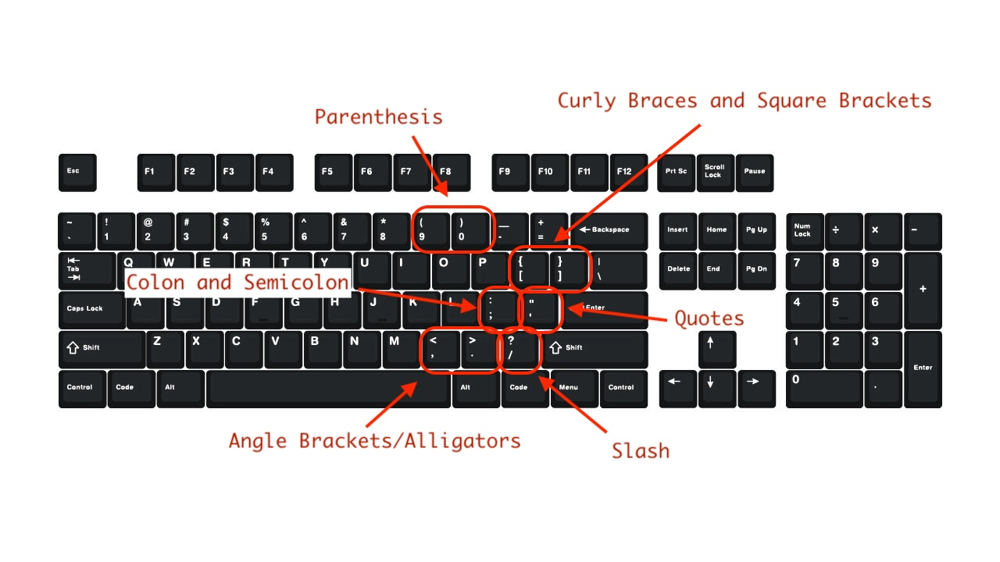

# Computer Skills

## Typing

Becoming a touch typist is an essential skill in our modern world. Here are a few webpages to help you practice.

* [Typing Club](https://www.typingclub.com/)
* [keybr](https://www.keybr.com/)

### Important Keys in Coding

| Character | Name & Use (HTML/CSS Examples)                                               |
| --------- | ---------------------------------------------------------------------------- |
| `<`       | **[Less than](https://www.edclub.com/sportal/program-3/451.play)** — starts HTML tags (`
`, `
`)                            |
| `>`       | **[Greater than](https://www.edclub.com/sportal/program-3/451.play)** — ends HTML tags (`
`, `
` closes)                   |
| `/`       | **[Slash](https://www.edclub.com/sportal/program-3/179.play)** — closes HTML tags (`</h1>`), used in self-closing tags (` `) |
| `&`       | **[Ampersand](https://www.edclub.com/sportal/program-3/389.play)** — writes HTML entities (`&amp;` for `&`, `&lt;` for `<`)       |
| `"`       | **[Double quote](https://www.edclub.com/sportal/program-3/433.play)** — wraps HTML attribute values (`<a href="link.html">`)      |
| `'`       | **[Single quote](https://www.edclub.com/sportal/program-3/433.play)** — alternative in attributes (`<a href='link.html'>`)        |
| `{` `}`   | **[Curly braces](https://www.edclub.com/sportal/program-3/445.play)** — wrap CSS rule blocks (`h1 { color: red; }`)               |
| `:`       | **[Colon](https://www.edclub.com/sportal/program-3/236.play)** — separates CSS property and value (`color: blue;`)                |
| `;`       | **[Semicolon](https://www.edclub.com/sportal/program-3/127.play)** — ends CSS declarations (`font-size: 16px;`)                   |
| `(` `)`   | **[Parentheses](https://www.edclub.com/sportal/program-3/374.play)** — used in CSS functions (`background: url('image.jpg')`)     |
| `[` `]`   | **[Square brackets](https://www.edclub.com/sportal/program-3/442.play)** - using in JavaScript for arrays (`names[0]`)

## Hotkeys

Hotkeys or "Shortcuts" are key combinations that help you get things done quickly on your keyboard. Try them out and see which are your favorites.

### Videos Explaining Shortcuts

* [Lea David's Shortcuts to save you time](https://www.youtube.com/watch?v=qoUmZ-buqr8)
* [Brett in Tech's guide to 20 shortcuts](https://www.youtube.com/watch?v=6C8vkVomRTo)
* [Another 20 Keyboard shortcuts](https://www.youtube.com/watch?v=RQaTIS85VKE)
* [Windows shortcuts for moving between windows and screenshots](https://www.youtube.com/watch?v=d_rH4uAm9MY)
* [Apple Mac Hotkeys](https://www.youtube.com/watch?v=jAyd89j0B58)

### Windows Keyboard Shortcuts

#### ✨ Basic Shortcuts
- **Copy** → `Ctrl + C`
- **Paste** → `Ctrl + V`
- **Cut** → `Ctrl + X`
- **Undo** → `Ctrl + Z`
- **Save** → `Ctrl + S`
- **New File / Window** → `Ctrl + N`
- **Print** → `Ctrl + P`
- **Bold** → `Ctrl + B`
- **Italic** → `Ctrl + I`
- **Underline** → `Ctrl + U`

#### ⚡ Quick Movements
- **Start of line** → `Home`
- **End of line** → `End`
- **Next word** → `Ctrl + Right`
- **Previous word** → `Ctrl + Left`
- **Select next word** → `Ctrl + Shift + Right`
- **Select all** → `Ctrl + A`
- **Comment Code** → `Ctrl + /`

#### 🌐 Browser Shortcuts
- **Open new tab** → `Ctrl + T`
- **Close tab** → `Ctrl + W`
- **Reopen closed tab** → `Ctrl + Shift + T`
- **Switch tabs** → `Ctrl + Tab`
- **Switch tabs reverse** → `Ctrl + Shift + Tab`
- **Refresh page** → `Ctrl + R`

* [Microsoft's shortcut reference](https://support.microsoft.com/en-us/windows/keyboard-shortcuts-in-windows-dcc61a57-8ff0-cffe-9796-cb9706c75eec)
* [Apple's hotkey reference](https://support.apple.com/en-us/102650)

### Chromebook hotkeys

* [Chromebook hotkeys](https://support.google.com/chromebook/answer/183101?hl=en)

### Switching Tasks

* [Guide to task switching](./computer-skills/switching-tasks.md)

## File System Guides

Navigating files and folders on your computer is a skill you should hone. Here are a few resources to teach yourself how to navigate Windows Explorer and Mac's Finder.

* Windows: [Navigating Files with Windows Explorer ](https://www.youtube.com/watch?v=-ixXAB2Gc0M)  
* Mac: [MacMost's Intro to the Finder](https://www.youtube.com/watch?v=TY_ViHj4gFU)

## Text Editors

### Notepad on Windows

* [Using Notepad to open and edit text files](https://www.youtube.com/watch?v=vdsHgK6wFA4&list=PL_dhPga7ruufQbp8l2cm-L8XYsHmTmzyB) Text files are important for coders. All the files we edit, txt, html, css, and so on are text files. We will use text editors like notepad and others to edit text on our computers so we don't need to rely on code.org's Web Lab.
* [How to edit HTML on Windows notepad](https://www.youtube.com/watch?v=XlOTHPBK2FY)

### TextEdit on Mac

* [MacMost's Intro to TextEdit](https://www.youtube.com/watch?v=73dhmeJx6Lk) Learn how to edit plain text files with TextEdit on a Mac.
* [How to edit HTML on Mac with TextEdit](https://www.youtube.com/watch?v=vrV2YIyYLOs)
* [Quick Guide to saving in HTML with TextEdit](https://docs.google.com/document/d/1--e-5E4Cp0fNIhBGxh7XVUXu-u8lHXDqvpVcPWm-uG0/edit?usp=sharing)

## Editing Photos and Pictures

* [Editing Photos on Windows 11](https://support.microsoft.com/en-us/windows/edit-photos-and-videos-in-windows-a3a6e711-1b70-250a-93fa-ef99048a2c86)
* [Editing Photos on Mac with Preview](https://www.youtube.com/watch?v=HF-nJiDKmN8)
* [Editing Photos on Chromebooks](https://www.google.com/chromebook/howto/open-and-edit-photos/)

## Advanced topics: The Command Line

The terminal, command prompt, or shell are names for the text-only interface to your computer. It can accomplish anything you can with Windows Explorer or with Mac Finder, and more. We will learn more about the command line as the course progresses, but you can have a peek at it with these resources.

* [Guide to insalling Bash on Windows](https://www.youtube.com/watch?v=cweFdzKMeS0)
* [Windows Git Bash Tutorial](https://www.youtube.com/watch?v=RBCq2mrXsMk)
* [Using the Terminal on Mac](https://www.youtube.com/watch?v=aKRYQsKR46I)
* [Command Line Introduction ](https://launchschool.com/books/command_line/read/introduction)
* [Introduction to Bash by Microsoft](https://learn.microsoft.com/en-us/training/modules/bash-introduction/)
