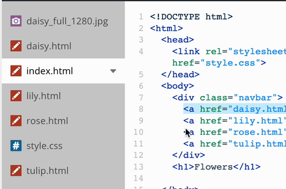

# Guide to Developing HTML & CSS on Your Local Filesystem

### What is a filesystem?

A **filesystem** is the way your computer (or another device) organizes and stores files. These files can be any type—images like PNG, JPEG, or GIF; proprietary formats like DOCX, XLS, or PSD; or web development files like HTML, CSS, or JS.

#### What is a local filesystem?

A **local filesystem** refers to files that are stored directly on your own computer’s hard drive. This means the actual data is right there, physically in your device.

By contrast, a **remote filesystem** stores files somewhere else—usually in a data center, accessed over the internet. For example, the files you use on code.org's Web Lab are stored online, making them part of a remote system. So, when you save a file in Web Lab, you’re saving it to code.org’s servers, not your own computer.

Sometimes, files can be both local and remote. If you use a service like OneDrive or Google Drive, your files may be saved on your own device (local), but also backed up or synced online (remote).

#### Why develop locally?

So far, you’ve been writing code in Web Lab on code.org. This has its benefits: It’s easy to get started, projects are organized for you, and files are simple to share online.

However, there are limitations:
- What happens if you lose internet access?
- What if code.org is slow or unavailable?
- What if you want to make customizations or use tools that aren’t supported by Web Lab?

In these cases, you need to work with files on your **local filesystem**. Learning how to download your work from Web Lab and edit it locally is an essential skill for both your class and your future career. Many developers work both locally and remotely, depending on the project and their needs.

Let’s explore how to develop your code locally!

## Step 1: Download a File from Web Lab

**Do This:**
1. Open your project in Web Lab on code.org.
2. Click the dropdown arrow next to `index.html` and select **Download**.
3. Find the downloaded file on your computer.
4. Double-click it to open in your web browser. (You should see your HTML, but CSS or images may be missing.)

**Show Me:**

  
Click to see how...

  
  

---

## Step 2: Download Your Full Project

**Do This:**
1. Create a new folder in your **Documents** directory for your website files.
2. Download all HTML, CSS, and image files from your project into this folder.
3. Make sure all files are in the same folder.
4. Double-click `index.html` to view your complete website in your browser.

---

## Step 3: Update Files Locally

**Do This:**
1. Right-click `index.html` and select **Open with…**
2. Choose **Notepad** (Windows), **TextEdit** (Mac), or **Text** (Chromebook).
   * On Mac, you may have trouble viewing the code in TextEdit. If so, see [this guide](https://docs.google.com/document/d/1--e-5E4Cp0fNIhBGxh7XVUXu-u8lHXDqvpVcPWm-uG0/edit?usp=sharing).
4. Your HTML code will open, just as it appeared on code.org.
5. Make a change (for example, update a `<h1>` tag).
6. Save the file. (Tip: Use a hotkey to save: **Ctrl+S** or **Cmd+S**)
7. Refresh the page in your browser to see your update. (Tip: use a hotkey to reload: **Ctrl+R** or **Cmd+R**)

---

## Step 4: Set Up for Local Development

Set yourself up for local development so that your are just as efficient locally as your are remotely. You will have to tile your windows to mimic the setup on code.org. This way you can see the both code and the rendered page at the same time.

**Do This:**
1. Tile your code editor (Notepad, TextEdit, etc.) to the left side of your screen.
    - [How to Arrange Windows and Multitask in Windows 11](https://www.microsoft.com/en-us/windows/getstarted)
    - [How to use window tiling on Mac (Apple Support)](https://support.apple.com/en-us/102575)
    - [How to tile windows on Chromebook](https://support.google.com/chromebook/answer/9577383)
2. Tile your web browser to the right.
3. Make changes in your code and save them (Tip use: **Ctrl+S** or **Cmd+S**).
4. Reload your browser to see your updates. (Tip use: **Ctrl+R** or **Cmd+R**).

---

## Step 5: Become a Poweruser

Ready to be more productive? Use a professional code editor for programming—they offer color coding, better search, and productivity features.

**Do This:**
1. Download and install a free advanced text editor. Here are two options.  
    - **Windows**: [Notepad++](https://notepad-plus-plus.org/downloads/)
    - **Mac**: [BBEdit](https://www.barebones.com/products/bbedit/download.html)
2. Open your project files with your new editor.
3. Explore features like syntax highlighting and tabs that make development faster and easier.
